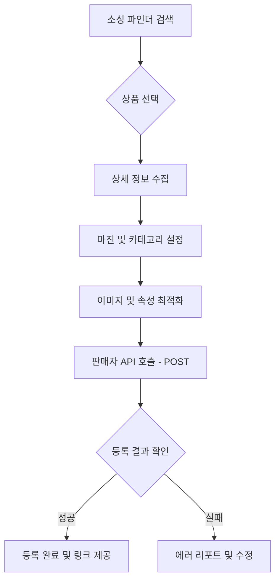

# 쿠팡 상품 등록(Listing) 자동화 로직 설계

쿠팡 파트너스 API로 찾은 상품을 내 마켓플레이스(판매자 센터)에 자동으로 등록하기 위한 고도화 설계안입니다.

## 1. 데이터 흐름 (Data Flow)



## 2. 핵심 단계별 구현 상세

### A. 상세 정보 수집 (Data Fetching)
*   **파트너스 API**: 썸네일과 기본 가격 정보만 제공.
*   **상세 페이지 파싱**: 실제 상품 URL(`productUrl`)에서 상세 이미지 리스트와 스펙(Attributes)을 추출하는 간단한 파서(Server-side)가 필요합니다. 

### B. 마진 계산 로직 (Margin Calculator)
사용자가 원하는 수익률을 적용하여 최종 판매가를 산출합니다.
*   `원가`: 파사몰 또는 쿠팡에서 가져온 공급가.
*   `쿠팡 수수료`: 카테고리별 약 10.5% ~ 13%.
*   `마진율(%)`: 사용자가 지정한 목표 수익.
*   **수식**: `최종 판매가 = (원가 + 배송비) * (1 + 마진율) / (1 - 수수료율)`

### C. 카테고리 매핑 (Category Mapping)
*   쿠팡 마켓플레이스는 `displayCategoryCode`를 필수로 요구합니다.
*   상품명에서 키워드를 추출하여 추천 카테고리를 보여주거나, 사용자가 직접 선택할 수 있는 검색 UI를 제공합니다.

### D. API 호출 페이로드 구조 (Seller API POST)
`POST /v2/providers/seller_api/apis/api/v1/marketplace/seller-products`

```json
{
  "displayCategoryCode": 123456, 
  "sellerProductName": "[프리미엄] 캠핑 의자 세트", 
  "vendorId": "A00XXXXXX",
  "salePrice": 45000,
  "maximumBuyCount": 99,
  "outboundShippingPlaceCode": 10001, 
  "deliveryCompanyCode": "KDEXP", 
  "deliveryChargeType": "FREE",
  "items": [
    {
      "itemName": "단일 옵션",
      "pccNeeded": false, 
      "images": [
        { "imageOrder": 0, "imageType": "REPRESENTATIVE", "vendorPath": "url_to_image" }
      ],
      "contents": [
        { "contentsType": "HTML", "content": "상세페이지 HTML내용" }
      ]
    }
  ]
}
```

## 3. UI/UX 개선 사항

### 1) "등록" 프로젝트 버튼
*   상품 카드 하단에 '스토어 등록' 버튼 추가.
*   클릭 시 상세 설정을 위한 **Slide-over Drawer** 오픈.

### 2) 설정 프리셋 (Presets)
*   배송비나 마진율을 미리 저장해두어 한 번의 클릭으로 등록 완료.

### 4) 등록 상태 모니터링
*   성공 시 등록된 `sellerProductId`를 통한 쿠팡 어드민 링크 제공.

## 4. 향후 확장성
*   **상품명 자동 최적화**: AI(GPT)를 연동하여 자극적인 키워드나 노출이 잘 되는 키워드로 상품명 변경 제안.
*   **상세 이미지 변역**: 해외 상품 소싱 시 이미지 내 텍스트 자동 번역 및 치환.
